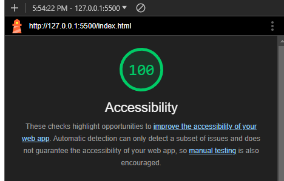
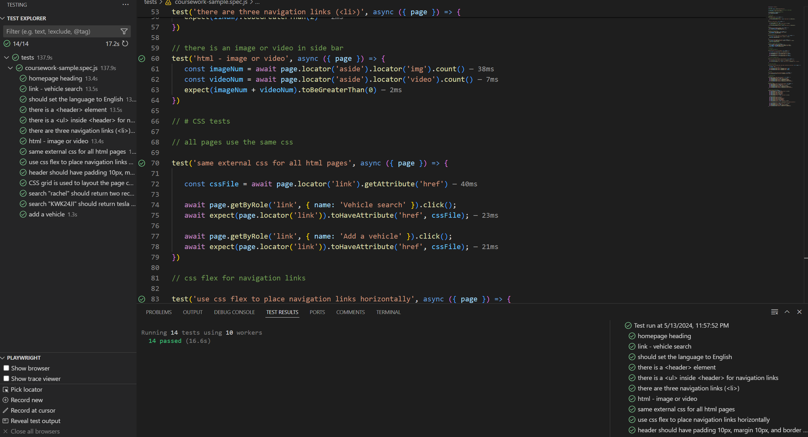

# Comp1004 Coursework

## HTML Criteria
1. The three pages are stored in [index.html](index.html) (People Search), [vs.html](vs.html) (Vehicle Search), and [av.html](av.html) (Add a Vehicle). 
2. See 1. The people search page is named index.html because this is the default page that should be loaded initially. I used to have index.html be a seperate page that redirects the user to the People Search page (see [indexOld.html](indexOld.html)), but this caused some tests to fail so I scrapped this idea.
3. Each page contains the following:
    - `<html lang="en">`
    - `<meta charset="UTF-8" />`
    - `<meta lang="en" />`
    - `<meta title="1004 Coursework" />`
4. All headings use `<h1>` and all other text uses `<li>` or `
`.
5. `<ul>` is used
6. Navigation works correctly
7. Each page has four sections, using `<header>`, `<aside>`, `<main>`, `<footer>`.
8. Each page has this image embedded in the sidebar: 
9. The page has 100 accessibility, as seen here: . One additional accessability feature that I added is allowing the submit buttons to be clicked by pressing enter when they are selected, allowing the website to be fully utilised without the use of a mouse.

## CSS Criteria
1. All pages use the [index.css](index.css) file for formatting.
2. The navigation links are list items (`<li>`) placed in an undordered list (`<ul>`). The `<ul>` uses the following styling: `display: flex; flex-direction: row; justify-content: space-around;`. This only targets `<ul>`s that are in a `<nav>`, so other parts of the page are not affected. `flex-direction: row` makes the link space out horizontally instead of vertically.
3. The styling is applied in `nav { ul { ... } }`.
4. All of the mentioned sections have the styling: `padding: 10px; margin: 10px; border-color: black; border-style: solid; border-width: 1px;`.
5. Styling is applied as specified using `display: grid;` to these elements
6. The website scales to different window sizes and will switch layout when the page width is less than 500px.

## JS Criteria
1. People can be searched using either search box (but not both at once, as specified in the Playwright tests). This uses Regex to allow partial matches. All metching results are returned.
2. Vehicles can be searched by number plate using Regex to allow for partial matches. All matching results are returned.
3. Vehicles can be added to the database, along with all details. If the owner does not exist in the database, the user is prompted to add the owner as well. The section to add the owner is otherwise hidden

## Playwright tests
My code passes all playwrght tests
